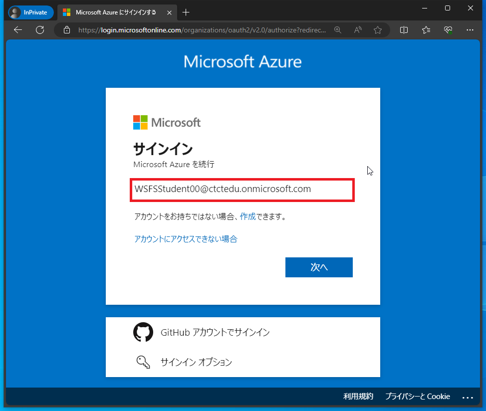
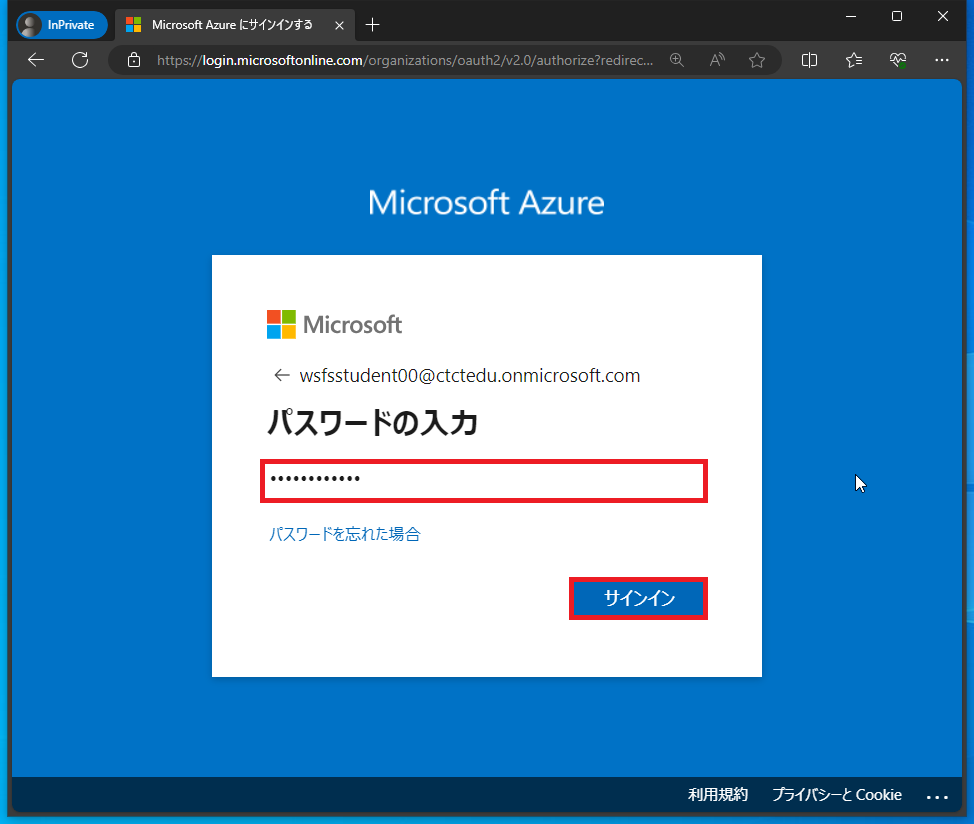
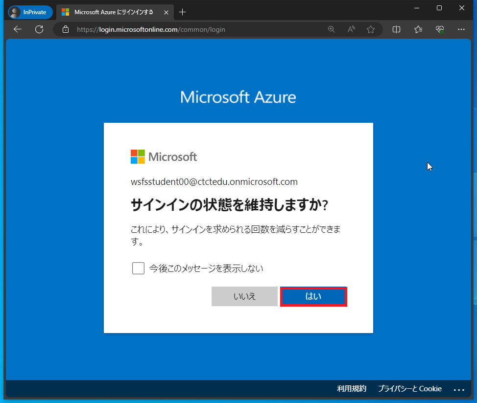
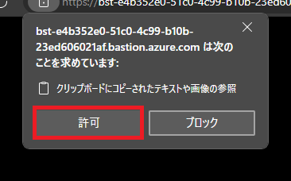
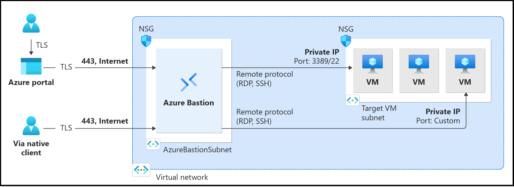

# Windows Serverシステム管理

# Webアクセス手順

## ラボ シナリオ

この手順は「Windows Server システム管理」の演習へWebブラウザを使用してアクセスする場合に使用する手順です。

講師より入手したアカウントを使用して、演習環境へアクセスしてください。

※演習環境はMicrosoft Azureの「Virtual Machine」サービスを使用しています

 

## 目標

+ タスク1：Azure Portalへサインインする
+ タスク2：演習環境にアクセスする

 

## 予想時間: 10 分

#### タスク1：Azure Portalへサインインする

1. Webブラウザを表示します。使用可能なWebブラウザは「Microsoft Edge」「Google Chrome」「Mozilla Firefox」が利用可能です。

     

2. 表示したWebブラウザを「InPrivate ウィンドウ」または「シークレットウィンドウ」で表示します。

    > 参考 各WebブラウザのInPrivateまたはシークレットの開き方は公式サイトを参照してください。
    >
    > | Webブラウザ     | 公式サイト                                                   |
    > | --------------- | ------------------------------------------------------------ |
    > | Microsoft Edge  | https://support.microsoft.com/ja-jp/microsoft-edge/microsoft-edge-%E3%81%A7-inprivate-%E3%83%96%E3%83%A9%E3%82%A6%E3%82%BA%E3%82%92%E4%BD%BF%E3%81%86-cd2c9a48-0bc4-b98e-5e46-ac40c84e27e2 |
    > | Google Chrome   | https://support.google.com/chrome/answer/95464?hl=ja&co=GENIE.Platform%3DDesktop |
    > | Mozilla Firefox | https://support.mozilla.org/ja/kb/private-browsing-use-firefox-without-history |

    ※キャプチャはMicrosoft Edgeを使用しています。

    

     

3. InPrivateまたはシークレットで開いたWebブラウザから以下にアクセスします。

    アクセス先URL：https://portal.azure.com

    

     

4. ユーザー名とパスワードを入力する画面が表示されます。

    講師からZoomチャットなどで取得したユーザー名とパスワードを使用してサインインします。

    | 項目                | 値                                                           |
    | ------------------- | ------------------------------------------------------------ |
    | メール、電話、Skype | `WSFSStudent##@ctctedu.onmicrosoft.com` ※##の部分には01～99の数字になります。 　講師から提示された番号に置き換え、入力してください。 |
    | パスワード          | Pa55w.rd1234                                                 |

    　

     

5. 「サインインの状態を維持しますか?」と表示されます。「はい」をクリックします。

    　

     

6. Azure Portalへサインインすることが出来ました。「Microsoft Azure へようこそ」と表示されます。「後で行う」をクリックします。

    

     

#### タスク2：演習環境にアクセスする

1. 画面内にある「Virtual Machine」のアイコンをクリックします。

    

     

1. 使用可能な仮想マシンが1台表示されます。仮想マシン名をクリックします。

    > ※キャプチャはWSFSVM00となっていますが、01～99までの数字が表示されます。

    

     

1. 使用する仮想マシンが表示されます。画面内にある「接続」→「Bastionを介した接続」をクリックします。

     

1. Bastionの画面が表示されます。「接続設定」をクリックします。

    

     

1. 「接続設定」では「キーボード言語」を「日本語」に選択します。

    

     

1. 少し下にスクロールすると「認証の種類」が表示されます。「ユーザー名」と「VMパスワード」を以下の通りに入力し、「接続」をクリックします。

    | 項目         | 値             |
    | ------------ | -------------- |
    | ユーザー名   | `ctct`         |
    | VMパスワード | `Pa55w.rd1234` |

    

     

1. Webブラウザで新しいタブが開き、Windows Serverの画面が表示されます。

    > 注意：ポップアップブロックで表示が失敗する場合があります。ポップアップブロックを許可してください。

    

     

1. クリップボードの許可画面が画面左上に表示される場合があります。「許可」をクリックします。

    　

    

    これで演習環境へのアクセスが完了しました。

    以降は講師の指示に従い、テキストの演習手順を実施してください。

     

     

------

**【参考】Microsoft Azureにご興味のある方向け**

本研修で使用する演習環境はMicrosoftのクラウドプラットフォーム「Microsoft Azure」を使用しています。

Azureサービスの「Virtual Machine (仮想マシン)」を使用してクラウド上 (Microsoftのデータセンター)にWindows Serverを構築しています。

> Azure での仮想マシン： https://learn.microsoft.com/ja-jp/azure/virtual-machines/overview

 

この仮想マシンへアクセスする場合、Windowsではリモートデスクトップ接続を行います。

ネットワークはパブリックインターネット経由、VPN経由、専用線接続(閉域網)でアクセスを行います。

パブリックインターネットで接続する場合、リモートデスクトップ接続(RDP：3389ポート)を解放する必要があります。

ですが、第三者からの攻撃によりRDPポートを攻撃され仮想マシンが乗っ取られる可能性もあります。

> リモート管理の脅威：https://learn.microsoft.com/ja-jp/azure/security/fundamentals/management#remote-management-threats

 

そのため、RDPポートはファイヤーウォールなどによりブロックすることが一般的です。

> この演習環境においてはRDPポートは解放しています。

あるいは、社内ネットワークからデータの不正流出を防ぐために、ネットワーク自体でRDPポートを遮断(ファイヤーウォールなど)することがあります。

 

その場合、メンテナンスや操作などにおいて、RDP接続が出来ない状態になります。

そこで使用するのが、RDP(3359)の接続ではなく、Webブラウザ経由のTLS(443)を使用したアクセス方法があります。

それが、今回操作して頂いた「Azure Bastion」というサービスになります。

> Azure Bastion とは：https://learn.microsoft.com/ja-jp/azure/bastion/bastion-overview

 このサービスは、Bastionが踏み台コンピュータとなります。

インターネット上に仮想マシンのグローバルIPアドレスを公開することなく且つ、Webブラウザ経由でセキュアに通信を行うことが可能です。

